# 🛠️ Cipher Alchemist - Complete Development Guide

## 📋 **Table of Contents**
- [🎯 Application Development](#-application-development)
- [🔮 Cipher Algorithms](#-cipher-algorithms)
- [🏗️ Project Structure](#️-project-structure)
- [🚀 CI/CD Pipeline](#-cicd-pipeline)
- [🔧 Local Development](#-local-development)
- [📊 Testing & Quality](#-testing--quality)
- [🎨 UI/UX Development](#-uiux-development)

---

## 🎯 **Application Development**

### **🔮 Core Application Overview**
Cipher Alchemist is a **client-side cryptographic toolkit** built with vanilla HTML, CSS, and JavaScript. It implements multiple classical cipher algorithms with a modern, responsive interface.

### **🏗️ Architecture Principles**
- **🌐 Client-Side Only** - No server dependencies, runs entirely in browser
- **📱 Progressive Enhancement** - Works on all devices and browsers
- **⚡ Performance First** - Optimized for speed and responsiveness
- **🛡️ Security Focused** - Implements cryptographic best practices
- **🎨 Modern UI/UX** - Clean, intuitive interface design

### **🔧 Technology Stack**

| Component | Technology | Purpose |
|-----------|------------|---------|
| **Frontend** | HTML5, CSS3, JavaScript (ES6+) | Core application |
| **Styling** | CSS Grid, Flexbox, Custom Properties | Responsive design |
| **Cryptography** | Custom JavaScript implementations | Cipher algorithms |
| **Build Process** | None (vanilla approach) | Simplicity and speed |
| **Deployment** | GitHub Pages | Static hosting |

---

## 🔮 **Cipher Algorithms**

### **🎯 Implemented Algorithms**

#### **1. 🔐 Caesar Cipher**
```javascript
// Core Implementation
function caesarCipher(text, shift) {
    return text.replace(/[A-Za-z]/g, char => {
        const start = char <= 'Z' ? 65 : 97;
        return String.fromCharCode(
            ((char.charCodeAt(0) - start + shift) % 26 + 26) % 26 + start
        );
    });
}

// Features:
- Variable shift values (1-25)
- Preserves case (uppercase/lowercase)
- Maintains non-alphabetic characters
- Bidirectional (encrypt/decrypt)
```

#### **2. 🎯 Atbash Cipher**
```javascript
// Core Implementation
function atbashCipher(text) {
    return text.replace(/[A-Za-z]/g, char => {
        if (char <= 'Z') {
            return String.fromCharCode(155 - char.charCodeAt(0));
        } else {
            return String.fromCharCode(219 - char.charCodeAt(0));
        }
    });
}

// Features:
- Ancient Hebrew substitution method
- Self-inverse (same function for encrypt/decrypt)
- Case preservation
- Simple A↔Z, B↔Y substitution pattern
```

#### **3. 🔄 ROT13 Cipher**
```javascript
// Core Implementation (specialized Caesar with shift=13)
function rot13(text) {
    return caesarCipher(text, 13);
}

// Features:
- Fixed 13-character shift
- Self-inverse operation
- Commonly used for simple obfuscation
- Compatible with ASCII art and special characters
```

#### **4. 🌟 Vigenère Cipher**
```javascript
// Core Implementation
function vigenereCipher(text, key, decrypt = false) {
    const keyRepeated = key.repeat(Math.ceil(text.length / key.length));
    let result = '';
    let keyIndex = 0;
    
    for (let i = 0; i < text.length; i++) {
        const char = text[i];
        if (/[A-Za-z]/.test(char)) {
            const shift = keyRepeated.charCodeAt(keyIndex % key.length) - 65;
            const actualShift = decrypt ? -shift : shift;
            result += caesarCipher(char, actualShift);
            keyIndex++;
        } else {
            result += char;
        }
    }
    return result;
}

// Features:
- Polyalphabetic substitution
- Variable-length keys
- Enhanced security vs. Caesar cipher
- Key repetition for longer texts
```

#### **5. 🔀 Playfair Cipher**
```javascript
// Core Implementation (simplified)
function playfairCipher(text, key) {
    // Generate 5x5 key matrix
    const matrix = generatePlayfairMatrix(key);
    
    // Process text in digraphs (pairs)
    const digraphs = preprocessText(text);
    
    // Apply Playfair rules
    return digraphs.map(pair => 
        applyPlayfairRules(pair, matrix)
    ).join('');
}

// Features:
- Digraph (two-letter) substitution
- 5x5 key matrix generation
- Special rules for same-letter pairs
- Enhanced security through position-based encryption
```

### **🔧 Algorithm Integration**

#### **Algorithm Manager Class**
```javascript
class CipherManager {
    constructor() {
        this.algorithms = {
            'caesar': new CaesarCipher(),
            'atbash': new AtbashCipher(),
            'rot13': new ROT13Cipher(),
            'vigenere': new VigenereCipher(),
            'playfair': new PlayfairCipher()
        };
    }
    
    encrypt(algorithm, text, params = {}) {
        return this.algorithms[algorithm].encrypt(text, params);
    }
    
    decrypt(algorithm, text, params = {}) {
        return this.algorithms[algorithm].decrypt(text, params);
    }
    
    getAlgorithmInfo(algorithm) {
        return this.algorithms[algorithm].getInfo();
    }
}
```

---

## 🏗️ **Project Structure**

### **📁 File Organization**
```
cipher-alchemist/
├── 📄 index.html              # Main application entry point
├── 🎨 styles/
│   ├── main.css              # Core application styles
│   ├── cipher-cards.css      # Algorithm card components
│   ├── animations.css        # Animation and transitions
│   └── responsive.css        # Mobile responsiveness
├── 🧠 scripts/
│   ├── app.js               # Main application logic
│   ├── cipher-algorithms.js  # All cipher implementations
│   ├── ui-controller.js     # User interface management
│   ├── input-validator.js   # Input validation and sanitization
│   └── utils.js             # Utility functions
├── 🎯 assets/
│   ├── icons/               # SVG icons and graphics
│   ├── images/              # Background images and visuals
│   └── fonts/               # Custom fonts (if any)
├── 📋 docs/
│   ├── README.md            # Project overview and features
│   ├── DEVELOPMENT.md       # This comprehensive guide
│   ├── CHANGELOG.md         # Version history and updates
│   └── API.md               # Algorithm API documentation
├── 🔧 .github/
│   └── workflows/           # CI/CD pipeline configurations
├── 📝 version.txt           # Current version information
└── 🌐 manifest.json         # Web app manifest (PWA ready)
```

### **🧩 Component Architecture**

#### **HTML Structure**
```html
<!DOCTYPE html>
<html lang="en">
<head>
    <!-- Meta tags and SEO optimization -->
    <meta charset="UTF-8">
    <meta name="viewport" content="width=device-width, initial-scale=1.0">
    <title>🔮 Cipher Alchemist - Cryptographic Toolkit</title>
    
    <!-- Stylesheets -->
    <link rel="stylesheet" href="styles/main.css">
    <link rel="stylesheet" href="styles/cipher-cards.css">
</head>
<body>
    <!-- Header Section -->
    <header class="app-header">
        <h1>🔮 Cipher Alchemist</h1>
        <nav class="algorithm-selector">
            <!-- Dynamic algorithm buttons -->
        </nav>
    </header>
    
    <!-- Main Application -->
    <main class="cipher-workspace">
        <!-- Input Section -->
        <section class="input-section">
            <textarea id="plaintext" placeholder="Enter your message..."></textarea>
            <div class="cipher-controls">
                <!-- Algorithm-specific controls -->
            </div>
        </section>
        
        <!-- Output Section -->
        <section class="output-section">
            <textarea id="ciphertext" readonly></textarea>
            <div class="output-actions">
                <button id="copy-result">📋 Copy Result</button>
                <button id="clear-all">🗑️ Clear All</button>
            </div>
        </section>
    </main>
    
    <!-- Footer -->
    <footer class="app-footer">
        <p>Built with ❤️ for cryptography enthusiasts</p>
    </footer>
    
    <!-- Scripts -->
    <script src="scripts/cipher-algorithms.js"></script>
    <script src="scripts/ui-controller.js"></script>
    <script src="scripts/app.js"></script>
</body>
</html>
```

#### **CSS Architecture**
```css
/* main.css - Core Styles */
:root {
    /* CSS Custom Properties */
    --primary-color: #2c3e50;
    --secondary-color: #3498db;
    --accent-color: #e74c3c;
    --background-color: #ecf0f1;
    --text-color: #2c3e50;
    --border-radius: 8px;
    --box-shadow: 0 2px 10px rgba(0,0,0,0.1);
    --transition: all 0.3s ease;
}

/* Modern CSS Grid Layout */
.cipher-workspace {
    display: grid;
    grid-template-columns: 1fr 1fr;
    gap: 2rem;
    padding: 2rem;
    max-width: 1200px;
    margin: 0 auto;
}

/* Responsive Design */
@media (max-width: 768px) {
    .cipher-workspace {
        grid-template-columns: 1fr;
        gap: 1rem;
        padding: 1rem;
    }
}
```

#### **JavaScript Architecture**
```javascript
// app.js - Main Application Controller
class CipherAlchemist {
    constructor() {
        this.cipherManager = new CipherManager();
        this.uiController = new UIController();
        this.validator = new InputValidator();
        this.init();
    }
    
    init() {
        this.setupEventListeners();
        this.loadAlgorithms();
        this.setDefaultAlgorithm();
    }
    
    setupEventListeners() {
        // Algorithm selection
        document.addEventListener('algorithmChange', this.handleAlgorithmChange.bind(this));
        
        // Input changes
        document.getElementById('plaintext').addEventListener('input', this.handleInputChange.bind(this));
        
        // Control changes
        document.addEventListener('controlChange', this.handleControlChange.bind(this));
    }
    
    async processText(text, algorithm, params, operation = 'encrypt') {
        try {
            // Validate input
            const validatedText = this.validator.validateText(text);
            const validatedParams = this.validator.validateParams(params, algorithm);
            
            // Process with selected algorithm
            const result = operation === 'encrypt' 
                ? this.cipherManager.encrypt(algorithm, validatedText, validatedParams)
                : this.cipherManager.decrypt(algorithm, validatedText, validatedParams);
            
            // Update UI
            this.uiController.updateOutput(result);
            
            return result;
        } catch (error) {
            this.uiController.showError(error.message);
            return null;
        }
    }
}

// Initialize application
document.addEventListener('DOMContentLoaded', () => {
    window.cipherApp = new CipherAlchemist();
});
```

---

## 🎨 **UI/UX Development**

### **🎭 Design Principles**

#### **Visual Design**
- **🌟 Mystical Theme** - Cryptographic magic meets modern design
- **🎨 Color Psychology** - Blues for trust, purples for mystery
- **⚡ Performance First** - Smooth animations and transitions
- **📱 Mobile-First** - Responsive design for all devices

#### **User Experience**
```javascript
// Real-time processing with debouncing
const debouncedProcess = debounce((text, algorithm, params) => {
    cipherApp.processText(text, algorithm, params);
}, 300);

// Progressive enhancement
if ('serviceWorker' in navigator) {
    // Enable offline functionality
    registerServiceWorker();
}

// Accessibility features
function enhanceAccessibility() {
    // ARIA labels for screen readers
    // Keyboard navigation support
    // High contrast mode detection
    // Focus management
}
```

### **🎯 Interactive Features**

#### **Algorithm Switching**
```javascript
class AlgorithmSwitcher {
    constructor() {
        this.currentAlgorithm = 'caesar';
        this.algorithms = ['caesar', 'atbash', 'rot13', 'vigenere', 'playfair'];
    }
    
    switchTo(algorithm) {
        // Smooth transition animation
        this.animateSwitch(() => {
            this.updateControls(algorithm);
            this.updateInstructions(algorithm);
            this.processCurrentText(algorithm);
        });
    }
    
    animateSwitch(callback) {
        // CSS transition for smooth switching
        document.querySelector('.cipher-controls').style.opacity = '0';
        setTimeout(() => {
            callback();
            document.querySelector('.cipher-controls').style.opacity = '1';
        }, 150);
    }
}
```

#### **Real-time Validation**
```javascript
class InputValidator {
    validateText(text) {
        // Length validation
        if (text.length > 10000) {
            throw new Error('Text too long (max 10,000 characters)');
        }
        
        // Character validation
        if (!/^[\x00-\x7F]*$/.test(text)) {
            console.warn('Non-ASCII characters detected - some algorithms may not process them');
        }
        
        return text;
    }
    
    validateKey(key, algorithm) {
        switch (algorithm) {
            case 'vigenere':
                if (!/^[A-Za-z]+$/.test(key)) {
                    throw new Error('Vigenère key must contain only letters');
                }
                break;
            case 'playfair':
                if (key.length < 1) {
                    throw new Error('Playfair cipher requires a key');
                }
                break;
        }
        return key;
    }
}
```

---

## 🚀 **CI/CD Pipeline**

### **🏗️ Workflow Architecture**

Our production-grade CI/CD pipeline provides automated deployment, monitoring, and maintenance:

```mermaid
graph TD
    A[Push to Main] --> B[🔄 Auto Version Update]
    B --> C[🌐 Deploy to GitHub Pages]
    
    D[Manual Release] --> E[🏷️ Create Tag & Release]
    E --> F{Auto Deploy?}
    F -->|Yes| G[🚀 Deploy by Version]
    F -->|No| H[Manual Deploy Later]
    
    G --> J[📊 Auto Status Check]
    C --> J
    
    I[Every 6 Hours] --> J
    J --> K[📋 Status Report]
    
    L[Emergency] --> M[⏪ Rollback Release]
    M --> J
    M --> N[🛡️ Workflow Preservation]
```



### **🔧 Workflow Details**

#### **1. 🔄 Auto Version Update**
- **Trigger**: Push to main branch
- **Purpose**: Automatic development versioning and deployment
- **Features**: Smart skip logic, IST timestamps, commit tracking

#### **2. 🏷️ Create Tag & Release**
- **Trigger**: Manual workflow dispatch
- **Purpose**: Semantic versioning and release management
- **Features**: Version validation, changelog generation, auto-deployment option

#### **3. 🚀 Deploy by Version**
- **Trigger**: Manual or auto-triggered from release
- **Purpose**: Version-specific deployments with validation
- **Features**: Environment selection, health checks, force deploy option

#### **4. 📊 Deployment Status** *(Auto-Triggered + Scheduled)*
- **Trigger**: Auto after deployments + Every 6 hours + Manual
- **Purpose**: Real-time deployment monitoring and health verification
- **Features**: Smart auto-triggering, custom URL monitoring, failure alerts, IST timestamps
- **Auto-Triggers**: Runs automatically after Deploy by Version, Create Tag & Release, and Rollback workflows

#### **5. ⏪ Rollback Release**
- **Trigger**: Manual emergency workflow
- **Purpose**: Emergency recovery with system integrity
- **Features**: Smart rollback strategies, workflow preservation

---

## 🔧 **Local Development**

### **🚀 Quick Start**

#### **Prerequisites**
```bash
# Required
- Modern web browser (Chrome 90+, Firefox 88+, Safari 14+)
- Git for version control
- Text editor (VS Code, Sublime Text, Atom)

# Recommended
- Live Server extension for real-time preview
- Browser developer tools familiarity
- Basic JavaScript and CSS knowledge
```

#### **Setup Process**
```bash
# 1. Clone the repository
git clone https://github.com/dhruvinrsoni/cipher-alchemist.git
cd cipher-alchemist

# 2. Open in your preferred editor
code .  # VS Code
# or
open . # macOS Finder
# or
explorer . # Windows Explorer

# 3. Start local development server
# Option A: VS Code Live Server extension
# Right-click index.html → "Open with Live Server"

# Option B: Python simple server
python -m http.server 8000
# Navigate to http://localhost:8000

# Option C: Node.js live-server
npx live-server

# 4. Open browser and navigate to the local server
# The application should load and be fully functional
```

### **🛠️ Development Workflow**

#### **Feature Development**
```bash
# 1. Create feature branch
git checkout -b feature/new-cipher-algorithm

# 2. Implement your changes
# - Add algorithm to scripts/cipher-algorithms.js
# - Update UI in scripts/ui-controller.js
# - Add styles in styles/cipher-cards.css
# - Test thoroughly in browser

# 3. Test your implementation
# - Test with various inputs
# - Verify encrypt/decrypt functionality
# - Check responsive design
# - Validate accessibility

# 4. Commit with descriptive message
git add .
git commit -m "feat: add new XYZ cipher algorithm

- Implement XYZ cipher encryption/decryption
- Add UI controls for algorithm parameters
- Include comprehensive input validation
- Add responsive design support"

# 5. Push and create pull request
git push origin feature/new-cipher-algorithm
```

#### **Code Organization Best Practices**
```javascript
// 🎯 Algorithm Implementation Template
class NewCipherAlgorithm {
    constructor() {
        this.name = 'New Cipher';
        this.description = 'Brief description of the algorithm';
        this.category = 'substitution'; // or 'transposition'
    }
    
    encrypt(plaintext, params = {}) {
        // Validate inputs
        this.validateInputs(plaintext, params);
        
        // Implementation logic
        try {
            const result = this.processText(plaintext, params, 'encrypt');
            return {
                success: true,
                result: result,
                algorithm: this.name,
                params: params
            };
        } catch (error) {
            return {
                success: false,
                error: error.message,
                algorithm: this.name
            };
        }
    }
    
    decrypt(ciphertext, params = {}) {
        // Similar to encrypt but for decryption
        return this.processText(ciphertext, params, 'decrypt');
    }
    
    validateInputs(text, params) {
        // Input validation logic
        if (!text || typeof text !== 'string') {
            throw new Error('Invalid input text');
        }
        // Additional parameter validation
    }
    
    getInfo() {
        return {
            name: this.name,
            description: this.description,
            category: this.category,
            parameters: this.getParameterDefinitions()
        };
    }
}
```

---

## 📊 **Testing & Quality Assurance**

### **🧪 Testing Strategy**

#### **Manual Testing Checklist**
```markdown
## ✅ Algorithm Testing
- [ ] **Encryption Accuracy** - Verify against known test vectors
- [ ] **Decryption Accuracy** - Ensure perfect round-trip
- [ ] **Edge Cases** - Empty strings, special characters, very long texts
- [ ] **Parameter Validation** - Invalid keys, out-of-range values
- [ ] **Error Handling** - Graceful failure with meaningful messages

## ✅ UI Testing
- [ ] **Responsive Design** - Test on mobile, tablet, desktop
- [ ] **Browser Compatibility** - Chrome, Firefox, Safari, Edge
- [ ] **Accessibility** - Screen reader support, keyboard navigation
- [ ] **Performance** - Smooth animations, fast processing
- [ ] **User Experience** - Intuitive flow, clear feedback

## ✅ Integration Testing
- [ ] **Algorithm Switching** - Smooth transitions between algorithms
- [ ] **Real-time Processing** - Immediate feedback on input changes
- [ ] **Copy/Paste Functionality** - Proper clipboard integration
- [ ] **Error Recovery** - Graceful handling of unexpected inputs
```

#### **Automated Testing Framework**
```javascript
// test-framework.js - Simple testing utility
class CipherTestFramework {
    constructor() {
        this.tests = [];
        this.results = [];
    }
    
    addTest(name, algorithm, plaintext, expectedCipher, params = {}) {
        this.tests.push({
            name,
            algorithm,
            plaintext,
            expectedCipher,
            params
        });
    }
    
    async runAllTests() {
        console.log('🧪 Running Cipher Algorithm Tests...');
        
        for (const test of this.tests) {
            const result = await this.runSingleTest(test);
            this.results.push(result);
            
            const status = result.passed ? '✅' : '❌';
            console.log(`${status} ${test.name}: ${result.message}`);
        }
        
        this.generateReport();
    }
    
    async runSingleTest(test) {
        try {
            const encrypted = cipherApp.cipherManager.encrypt(
                test.algorithm, 
                test.plaintext, 
                test.params
            );
            
            const passed = encrypted.result === test.expectedCipher;
            
            return {
                testName: test.name,
                passed: passed,
                message: passed ? 'Test passed' : `Expected: ${test.expectedCipher}, Got: ${encrypted.result}`,
                algorithm: test.algorithm
            };
        } catch (error) {
            return {
                testName: test.name,
                passed: false,
                message: `Test failed with error: ${error.message}`,
                algorithm: test.algorithm
            };
        }
    }
}

// Test definitions
const testSuite = new CipherTestFramework();

// Caesar Cipher Tests
testSuite.addTest('Caesar Basic', 'caesar', 'HELLO', 'KHOOR', { shift: 3 });
testSuite.addTest('Caesar Wrap', 'caesar', 'XYZ', 'ABC', { shift: 3 });

// Atbash Cipher Tests
testSuite.addTest('Atbash Basic', 'atbash', 'HELLO', 'SVOOL');

// ROT13 Tests
testSuite.addTest('ROT13 Basic', 'rot13', 'HELLO', 'URYYB');

// Run tests (in browser console)
// testSuite.runAllTests();
```
