# 🛠️ Cipher Alchemist - Complete Development Guide

> **Latest Update**: Now featuring comprehensive keyboard accessibility with help modal system, enhanced CI/CD workflows, and professional documentation structure.

## 📋 **Table of Contents**
- [🆕 Recent Improvements](#-recent-improvements)
- [🎯 Application Development](#-application-development)
- [📦 Modular Architecture](#-modular-architecture)
- [🔮 Cipher Implementation](#-cipher-implementation)
- [🏗️ Actual Project Structure](#️-actual-project-structure)
- [🚀 CI/CD Pipeline](#-cicd-pipeline)
- [🔧 Local Development & Testing](#-local-development--testing)
- [📚 Documentation & Resources](#-documentation--resources)
- [🎯 Next Steps & Roadmap](#-next-steps--roadmap)

---

## 🆕 **Recent Improvements**

### **⌨️ Keyboard Accessibility System (Latest)**
- **Comprehensive Keyboard Navigation** - Full app control via keyboard
- **YouTube-style Help Modal** - `Ctrl+?` opens shortcuts guide (like YouTube)
- **Multiple Trigger Methods** - `Ctrl+?`, `Ctrl+/`, `Ctrl+.`, `F1`, and button click
- **Focus Management** - Proper focus trapping and restoration
- **ARIA Support** - Screen reader compatibility and WCAG 2.1 AA compliance

### **📱 PWA Install Enhancement (Latest)**
- **Smart Install Button** - Appears only when PWA is installable
- **Cross-Browser Support** - Works on Chrome, Firefox, Safari, Edge
- **Manual Fallback** - Instructions for browsers without automatic prompt
- **Install Detection** - Button hides when app is already installed
- **User-Friendly Prompts** - Clear instructions for different browsers

### **🔧 Enhanced CI/CD Pipeline**
- **Fixed Tag Detection** - Added `fetch-depth: 0` to deployment status workflow
- **Comprehensive Documentation** - Added `[skip ci]` usage guide for emergency scenarios
- **Automated Health Monitoring** - Regular deployment status checks
- **Smart Version Management** - IST timezone timestamps with proper loop prevention

### **📚 Professional Documentation Structure**
- **Refactored README** - Clean, badge-enhanced overview with clear sections
- **Enhanced Git Workflow Guide** - Comprehensive `[skip ci]` documentation
- **Complete Keyboard Testing Guide** - Full accessibility testing procedures
- **Documentation Index** - Centralized navigation for all documentation

### **🎨 UI/UX Enhancements**
- **Top Controls Layout** - Reorganized header with keyboard help and PWA install buttons
- **Professional Modal Design** - Material Design-inspired help modal
- **Responsive Design** - Mobile-optimized keyboard shortcuts interface
- **Theme Integration** - Dark/light mode support for help modal
- **Smart Install UX** - Context-aware PWA installation prompts

---

## 🎯 **Application Development**

### **🔮 Core Application Overview**
Cipher Alchemist is a **client-side password generation tool** built with vanilla HTML, CSS, and JavaScript. It implements character substitution to transform memorable phrases into strong passwords with a modern, responsive interface.

### **🏗️ Architecture Principles**
- **🌐 Client-Side Only** - No server dependencies, runs entirely in browser
- **📱 Progressive Enhancement** - Works on all devices and browsers
- **⚡ Performance First** - Optimized for speed and responsiveness
- **🛡️ Security Focused** - Implements password generation best practices
- **🎨 Modern UI/UX** - Clean, intuitive interface design

### **🔗 URL Parameter Integration**
The application supports direct phrase input via URL parameters for instant password generation and sharing examples:

**Implementation Details:**
```javascript
// Location: js/main.js - handleURLParameters()
function handleURLParameters() {
    const urlParams = new URLSearchParams(window.location.search);
    const phraseParam = urlParams.get('phrase');
    
    if (phraseParam) {
        const decodedPhrase = decodeURIComponent(phraseParam);
        // Auto-load, generate, and display with visual feedback
    }
}
```

**Supported Parameters:**
- **`?phrase=YourPhrase`** - Pre-fills input and auto-generates password
- **URL Encoding** - Handles special characters automatically
- **Visual Feedback** - Subtle animation shows parameter was loaded

**Use Cases:**
- **Documentation Links** - Direct examples in README and case studies
- **Training Materials** - Instant demos for security education
- **Team Sharing** - Share specific password patterns
- **Live Demonstrations** - No manual typing needed for presentations

**Example URLs:**
```
https://dhruvinrsoni.github.io/cipher-alchemist/?phrase=Q4Target2025Sales
https://dhruvinrsoni.github.io/cipher-alchemist/?phrase=MyUni2025Spring
https://dhruvinrsoni.github.io/cipher-alchemist/?phrase=SecureMoney2025
```

### **🔗 Social Sharing Integration**
Educational social media sharing system that creates safe, shareable content:

**Implementation Details:**
```javascript
// Location: js/main.js - shareExample()
function shareExample() {
    const shareUrl = `${baseUrl}?phrase=${encodeURIComponent(phrase)}`;
    const socialContent = {
        title: '🔮 Try This Password Security Example!',
        text: `Check out this password generation example...`,
        url: shareUrl,
        hashtags: ['PasswordSecurity', 'CyberSecurity', 'TechEducation']
    };
    showSharingModal(socialContent);
}
```

**Security Features:**
- **Privacy-First Design** - Only phrases shared, never actual passwords
- **Educational Focus** - Promotes cybersecurity awareness
- **URL Encoding** - Safe handling of special characters
- **Modal Interface** - Clear sharing options and privacy disclosure

**Supported Platforms:**
- **Twitter** - Educational posts with relevant hashtags
- **LinkedIn** - Professional cybersecurity content
- **Reddit** - Community discussions and demos
- **Native Share** - Mobile/tablet device integration (auto-detected)
- **Direct Link** - Enhanced copy URL with beautiful input interface

**Modal Components:**
- **Privacy Preview** - Shows what data is shared vs. protected
- **Platform Buttons** - One-click sharing to popular platforms
- **Native Share Button** - Appears automatically on supported devices
- **Enhanced URL Display** - Interactive input with integrated copy button
- **Keyboard Navigation** - Full accessibility support
- **Mobile Optimized** - Responsive design for all screen sizes

**Enhanced Technical Features:**
```javascript
// Native Share API Detection
if (navigator.share && nativeShareBtn) {
    nativeShareBtn.style.display = 'block';
}

// Enhanced URL Input with Copy Button
<div class="share-url-input-wrapper">
    <input onclick="this.select()" title="Click to select URL">
    <button class="url-copy-btn" onclick="copyShareUrl()">📋</button>
</div>

// Native Share Implementation
function useNativeShare(url, title, text) {
    navigator.share({ title, text, url })
        .then(() => closeSharingModal())
        .catch(() => copyShareUrl(url)); // Fallback
}
```

**CSS Enhancements:**
```css
.share-url-container {
    background: var(--card-bg);
    border: 2px solid var(--card-border);
    border-radius: 12px;
    box-shadow: 0 2px 8px rgba(0, 0, 0, 0.05);
    transition: all 0.2s ease;
}

.share-btn.native {
    background: linear-gradient(135deg, #667eea 0%, #764ba2 100%);
    animation: shimmer 0.5s ease-in-out;
}
```

### **🔧 Technology Stack**

| Component | Technology | Purpose |
|-----------|------------|---------|
| **Frontend** | HTML5, CSS3, JavaScript (ES6+) | Core application |
| **Styling** | CSS Grid, Flexbox, Custom Properties | Responsive design |
| **Password Generation** | Custom JavaScript implementations | Character substitution |
| **Build Process** | None (vanilla approach) | Simplicity and speed |
| **Deployment** | GitHub Pages | Static hosting |

---

## 📦 **Modular Architecture**

### **🎯 Code Organization Strategy**
The codebase has been **refactored from a monolithic structure** to a clean, modular architecture for improved maintainability, code organization, and scalability.

### **📁 Modular File Structure**
```
cipher-alchemist/
├── css/                    # Modular CSS files
│   ├── themes.css         # Theme system & CSS variables
│   ├── main.css          # Core layout & base styles
│   ├── password-strength.css # Strength meter styling
│   └── phrase-suggestions.css # Suggestion UI styles
├── js/                     # Modular JavaScript files
│   ├── cipher-algorithms.js   # Password generation logic
│   ├── password-strength.js   # Strength analysis system
│   ├── phrase-suggestions.js  # Suggestion management
│   └── main.js               # App initialization & core logic
├── index.html              # Updated with modular imports
├── scripts.js              # BACKUP - Original monolithic file
├── styles.css              # BACKUP - Original monolithic file
└── [other project files...]
```

### **🔧 Module Dependencies**
```
index.html
├── CSS (parallel loading)
│   ├── themes.css (base variables)
│   ├── main.css (depends on themes)
│   ├── password-strength.css (depends on themes)
│   └── phrase-suggestions.css (depends on themes)
└── JavaScript (sequential loading with defer)
    ├── cipher-algorithms.js (provides: substitutions, generatePassword)
    ├── password-strength.js (provides: calculatePasswordScore, checkStrength)
    ├── phrase-suggestions.js (provides: populateSuggestions, toggleSuggestions)
    └── main.js (provides: initializeApp, event handlers)
```

### **🚀 Benefits of Modular Architecture**

#### **Code Organization**
- **Separation of Concerns** - Each module handles a specific feature
- **Maintainability** - Easier to locate and modify specific functionality
- **Readability** - Smaller, focused files are easier to understand
- **Collaboration** - Multiple developers can work on different modules

#### **Performance**
- **Parallel Loading** - CSS files load simultaneously
- **Caching** - Individual modules can be cached separately
- **Selective Updates** - Only modified modules need updating
- **Debugging** - Easier to isolate issues to specific modules

#### **Development Workflow**
- **Feature Development** - Work on specific features without affecting others
- **Testing** - Test individual modules in isolation
- **Code Review** - Smaller, focused pull requests
- **Deployment** - Granular control over what gets updated

### **📝 Module Breakdown**

#### **CSS Modules**
- **`themes.css`** - CSS custom properties for light/dark themes
- **`main.css`** - Core layout, typography, and base component styles
- **`password-strength.css`** - Modern circular progress meter and criteria grid
- **`phrase-suggestions.css`** - Suggestion chips, animations, and responsive behavior

#### **JavaScript Modules**
- **`cipher-algorithms.js`** - Character substitution mapping and password generation
- **`password-strength.js`** - Real-time strength analysis and meter display
- **`phrase-suggestions.js`** - 48 inspirational phrases across 12 categories
- **`main.js`** - Application initialization, event binding, and core UI logic

### **🔄 Migration Strategy**
1. **✅ Complete** - Original monolithic files preserved as backups
2. **✅ Complete** - All functionality extracted into focused modules
3. **✅ Complete** - HTML updated to reference modular files
4. **✅ Complete** - Load order optimized for dependencies
5. **✅ Complete** - All features tested and validated

---

## 🔮 **Cipher Implementation**

### **🎯 Current Algorithm**

The application currently implements a **single character substitution cipher** that transforms characters using a predefined mapping for password generation.

#### **Character Substitution Mapping**
```javascript
// Implementation: js/cipher-algorithms.js
const substitutions = {
    'a': '@', 'b': '6', 'c': '(', 'd': 'cl', 'e': 'e', 'f': 'ph', 
    'g': '9', 'h': '#', 'i': '!', 'j': ']', 'k': '|<', 'l': '1', 
    'm': '/\\/\\', 'n': '|\\|', 'o': '0', 'p': '|>', 'q': 'q', 'r': 'r', 
    's': '5', 't': '+', 'u': 'v', 'v': '\\/', 'w': '\\/\\/', 'x': '><', 
    'y': 'y', 'z': '2',
    // Uppercase and numbers also supported
};
```

**Core Features:**
- **Character-by-character transformation** - Each character maps to a specific substitute
- **Mixed case support** - Both uppercase and lowercase transformations
- **Number substitution** - Digits also get transformed
- **Leetspeak-inspired** - Uses common symbol substitutions for security

**Implementation Files:**
- **[js/cipher-algorithms.js](../js/cipher-algorithms.js)** - Core substitution logic and password generation
- **[js/password-strength.js](../js/password-strength.js)** - Real-time strength analysis
- **[js/phrase-suggestions.js](../js/phrase-suggestions.js)** - Suggestion system

---

## 🏗️ **Actual Project Structure**

### **📁 Current File Organization**
```
cipher-alchemist/
├── 📄 index.html              # Main application entry point
├── 📄 manifest.json           # PWA configuration
├── 📄 version.txt             # Version tracking
├── 🎨 css/                    # Modular stylesheets
│   ├── themes.css            # Theme system & CSS variables
│   ├── main.css              # Core layout & base styles
│   ├── password-strength.css # Strength meter styling
│   ├── phrase-suggestions.css # Suggestion UI styles
│   ├── keyboard-shortcuts.css # Help modal styling
│   └── modal.css             # General modal components
├── 🔧 js/                     # Modular JavaScript
│   ├── cipher-algorithms.js   # Character substitution logic
│   ├── password-strength.js   # Real-time strength analysis
│   ├── phrase-suggestions.js  # 48 inspirational phrases
│   ├── keyboard-shortcuts.js  # Help modal functionality
│   └── main.js               # App initialization & UI logic
├── 📚 docs/                   # Comprehensive documentation
├── 🔧 config/                 # PWA service worker
├── 📦 assets/                 # Icons and static resources
└── 💾 backup/                 # Original monolithic files
```

### **🎯 Actual Application Structure**

The current implementation features a single-page application with these key components:

**Top Controls:**
- **Theme Toggle** (🌙) - Switch between light/dark modes
- **Keyboard Help** (⌨️) - Opens comprehensive shortcuts modal (Ctrl+?)
- **PWA Install** (📱) - Smart install button (appears when installable)

**Main Application:**
- **About Section** - Collapsible app description with example phrase
- **Phrase Input** - Text input for memorable phrases
- **Suggestion System** - 12 themed groups with 4 inspirational phrases each
- **Password Output** - Generated password with transformation explanation
- **Strength Analysis** - Real-time password strength meter and criteria

**Key Features:**
- **Progressive Enhancement** - Works without JavaScript, enhanced with it
- **Accessibility** - Screen reader support, keyboard navigation, skip links  
- **PWA Ready** - Offline capability, installable, responsive design
- **Theme Support** - Complete dark/light mode with CSS custom properties

### **📁 Actual File References**

**Core Implementation:**
- **[index.html](../index.html)** - Single-page application with modular imports
- **[js/main.js](../js/main.js)** - App initialization, event handling, PWA install logic
- **[js/cipher-algorithms.js](../js/cipher-algorithms.js)** - Character substitution and password generation
- **[js/password-strength.js](../js/password-strength.js)** - Real-time strength analysis system
- **[js/phrase-suggestions.js](../js/phrase-suggestions.js)** - 48 curated phrases across 12 themes
- **[js/keyboard-shortcuts.js](../js/keyboard-shortcuts.js)** - Help modal and keyboard navigation

**Styling:**
- **[css/themes.css](../css/themes.css)** - CSS custom properties for theming
- **[css/main.css](../css/main.css)** - Core layout and component styles
- **[css/password-strength.css](../css/password-strength.css)** - Circular progress meter
- **[css/phrase-suggestions.css](../css/phrase-suggestions.css)** - Suggestion chips and animations
- **[css/keyboard-shortcuts.css](../css/keyboard-shortcuts.css)** - Help modal styling

---

## 🎨 **UI/UX Development**

### **🎭 Design Principles**

#### **Visual Design**
- **🌟 Mystical Theme** - Cryptographic magic meets modern design
- **🎨 Color Psychology** - Blues for trust, purples for mystery
- **⚡ Performance First** - Smooth animations and transitions
- **📱 Mobile-First** - Responsive design for all devices

#### **User Experience**
```javascript
// Real-time processing with debouncing
const debouncedProcess = debounce((text, algorithm, params) => {
    cipherApp.processText(text, algorithm, params);
}, 300);

// Progressive enhancement
if ('serviceWorker' in navigator) {
    // Enable offline functionality
    registerServiceWorker();
}

// Accessibility features
function enhanceAccessibility() {
    // ARIA labels for screen readers
    // Keyboard navigation support
    // High contrast mode detection
    // Focus management
}
```

---

## 🚀 **CI/CD Pipeline**

### **🏗️ Workflow Architecture**

Our production-grade CI/CD pipeline provides automated deployment, monitoring, and maintenance:

```mermaid
graph TD
    A[Push to Main] --> B[🔄 Auto Version Update]
    B --> C[🌐 Deploy to GitHub Pages]
    
    D[Manual Release] --> E[🏷️ Create Tag & Release]
    E --> F{Auto Deploy?}
    F -->|Yes| G[🚀 Deploy by Version]
    F -->|No| H[Manual Deploy Later]
    
    G --> J[📊 Auto Status Check]
    C --> J
    
    I[Every 6 Hours] --> J
    J --> K[📋 Status Report]
    
    L[Emergency] --> M[⏪ Rollback Release]
    M --> J
    M --> N[🛡️ Workflow Preservation]
```



### **🔧 Workflow Details**

#### **1. 🔄 Auto Version Update**
- **Trigger**: Push to main branch
- **Purpose**: Automatic development versioning and deployment
- **Features**: Smart skip logic, IST timestamps, commit tracking

#### **2. 🏷️ Create Tag & Release**
- **Trigger**: Manual workflow dispatch
- **Purpose**: Semantic versioning and release management
- **Features**: Version validation, changelog generation, auto-deployment option

#### **3. 🚀 Deploy by Version**
- **Trigger**: Manual or auto-triggered from release
- **Purpose**: Version-specific deployments with validation
- **Features**: Environment selection, health checks, force deploy option

#### **4. 📊 Deployment Status** *(Auto-Triggered + Scheduled)*
- **Trigger**: Auto after deployments + Every 6 hours + Manual
- **Purpose**: Real-time deployment monitoring and health verification
- **Features**: Smart auto-triggering, custom URL monitoring, failure alerts, IST timestamps
- **Auto-Triggers**: Runs automatically after Deploy by Version, Create Tag & Release, and Rollback workflows

#### **5. ⏪ Rollback Release**
- **Trigger**: Manual emergency workflow
- **Purpose**: Emergency recovery with system integrity
- **Features**: Smart rollback strategies, workflow preservation

---

## 🔧 **Local Development**

### **🚀 Quick Start**

#### **Prerequisites**
```bash
# Required
- Modern web browser (Chrome 90+, Firefox 88+, Safari 14+)
- Git for version control
- Text editor (VS Code, Sublime Text, Atom)

# Recommended
- Live Server extension for real-time preview
- Browser developer tools familiarity
- Basic JavaScript and CSS knowledge
```

#### **Setup Process**
```bash
# 1. Clone the repository
git clone https://github.com/dhruvinrsoni/cipher-alchemist.git
cd cipher-alchemist

# 2. Open in your preferred editor
code .  # VS Code
# or
open . # macOS Finder
# or
explorer . # Windows Explorer

# 3. Start local development server
# Option A: VS Code Live Server extension
# Right-click index.html → "Open with Live Server"

# Option B: Python simple server
python -m http.server 8000
# Navigate to http://localhost:8000

# Option C: Node.js live-server
npx live-server

# 4. Open browser and navigate to the local server
# The application should load and be fully functional
```

### **🛠️ Development Workflow**

#### **Feature Development**
```bash
# 1. Create feature branch
git checkout -b feature/new-enhancement

# 2. Implement your changes
# - Modify existing js/cipher-algorithms.js for character substitution changes
# - Update js/main.js for UI enhancements
# - Add styles to appropriate css/ modules
# - Test thoroughly in browser

# 3. Test your implementation
# - Test phrase transformation functionality
# - Verify password strength analysis
# - Check responsive design
# - Validate accessibility

# 4. Commit with descriptive message
git add .
git commit -m "feat: enhance password generation system

- Improve character substitution mappings
- Add new phrase suggestion categories
- Enhance password strength analysis
- Add responsive design improvements"

# 5. Push and create pull request
git push origin feature/new-enhancement
```

---

## 🔧 **Local Development & Testing**

### **🚀 Development Setup**

**Prerequisites:**
- Modern web browser (Chrome 90+, Firefox 88+, Safari 14+)
- Text editor (VS Code recommended)
- Basic understanding of HTML, CSS, and JavaScript

**Quick Start:**
```bash
# Clone and navigate to project
git clone https://github.com/dhruvinrsoni/cipher-alchemist.git
cd cipher-alchemist

# Open with VS Code (or your preferred editor)
code .

# Start local server (multiple options):
# Option 1: VS Code Live Server extension (recommended)
# Option 2: Python server
python -m http.server 8000
# Option 3: Node.js live-server
npx live-server
```

### **🧪 Testing Guidelines**

**Manual Testing Areas:**
- **Character Substitution** - Test phrase transformation accuracy
- **Password Strength** - Verify real-time strength analysis
- **Phrase Suggestions** - Check all 12 themed groups (48 phrases total)
- **Responsive Design** - Test mobile, tablet, desktop layouts
- **Accessibility** - Keyboard navigation, screen reader compatibility
- **PWA Functionality** - Install button, offline capability, theme switching
- **Keyboard Shortcuts** - Help modal triggers (Ctrl+?, Ctrl+/, Ctrl+., F1)
- **Secret Developer Access** - Test developer dashboard access methods

**🕵️ Secret Developer Access Testing:**

The application includes a secure secret access system for developers to access the comprehensive test dashboard (`dev.html`). This system is designed to prevent accidental activation while providing secure access for development and testing purposes.

**Access Methods:**
1. **Keyboard Sequence** (Primary Method):
   - Hold `Ctrl + Shift` simultaneously
   - Type `d`, `e`, `v` in sequence
   - Release all keys
   - Developer dashboard will open in a new tab/window

2. **Title Click Method** (Alternative):
   - Click the app title "Cipher Alchemist" 5 times rapidly
   - All clicks must occur within 2 seconds
   - Developer dashboard will open after the 5th click

**Security Features:**
- **Non-Accidental Activation**: Much more secure than simple "dev" typing
- **Time-based Validation**: Click sequence has a 2-second window
- **Key Combination Required**: Ctrl+Shift modifier prevents accidental activation
- **Production Safe**: Works in both local and production environments
- **Clean Timeout**: Sequences reset automatically after timeout

**Testing the Secret Access:**
```javascript
// Test keyboard sequence
// 1. Hold Ctrl+Shift
// 2. Press 'd' (while holding modifiers)
// 3. Press 'e' (while holding modifiers) 
// 4. Press 'v' (while holding modifiers)
// 5. Release all keys → Developer dashboard opens

// Test title clicks
// 1. Click app title 5 times rapidly (within 2 seconds)
// 2. After 5th click → Developer dashboard opens
```

**Implementation Details:**
- Located in `js/main.js` - Secret access system
- Accessible dashboard: `dev.html` - Comprehensive test suite
- Fallback test file: `test-suite-comprehensive.html` - Alternative testing interface
- Zero performance impact when not activated
- No console output to prevent discovery in production

**Browser Testing:**
- Chrome/Edge (Chromium-based)
- Firefox
- Safari (WebKit-based)
- Mobile browsers (iOS Safari, Chrome Mobile)

**Key Test Scenarios:**
1. **Basic Functionality** - Enter phrase → Generate password → Check strength
2. **Suggestion System** - Click suggestion → Auto-populate → Generate
3. **PWA Install** - Click install button → Follow prompts → Verify installation
4. **Keyboard Help** - Press Ctrl+? → Modal opens → Navigate with keyboard
5. **Theme Switching** - Toggle theme → Verify all components update
6. **Responsive Design** - Resize window → Check layout adaptation

### **📝 Development Guidelines**

**Code Style:**
- Use modern JavaScript (ES6+)
- Follow consistent naming conventions
- Add comments for complex logic
- Maintain modular architecture

**File Organization:**
- Keep related functionality in focused modules
- Use descriptive file and function names
- Maintain clear separation of concerns
- Update documentation with changes

---

## 📚 **Documentation & Resources**

### **📖 Complete Documentation**

- **[Main README](README.md)** - Project overview and quick start
- **[Git Workflow Guide](GIT_WORKFLOW_GUIDE.md)** - CI/CD and `[skip ci]` usage
- **[Keyboard Testing Guide](KEYBOARD_TESTING_GUIDE.md)** - Accessibility testing procedures
- **[Documentation Index](INDEX.md)** - Central navigation hub
- **[Changelog](CHANGELOG.md)** - Version history and updates

### **🔗 External Resources**

- **[GitHub Repository](https://github.com/dhruvinrsoni/cipher-alchemist)** - Source code and issues
- **[Live Application](https://dhruvinrsoni.github.io/cipher-alchemist/)** - Deployed version
- **[PWA Documentation](https://web.dev/progressive-web-apps/)** - Progressive Web App guides
- **[Accessibility Guidelines](https://www.w3.org/WAI/WCAG21/quickref/)** - WCAG 2.1 reference

---

## 🎯 **Next Steps & Roadmap**

### **Completed Features ✅**
- Character substitution password generation
- Real-time password strength analysis  
- 48 inspirational phrase suggestions across 12 themes
- Comprehensive keyboard accessibility with help modal
- PWA installation with cross-browser support
- Professional documentation structure
- Automated CI/CD pipeline with monitoring

### **Potential Enhancements 🔮**
- Additional character substitution patterns
- Password history and favorites
- Custom phrase categories
- Export/import functionality
- Advanced strength analysis algorithms
- Multi-language support
- Offline phrase suggestion caching

### **Contributing 🤝**
Cipher Alchemist welcomes contributions! Please see our [Git Workflow Guide](GIT_WORKFLOW_GUIDE.md) for detailed contribution procedures, including proper use of `[skip ci]` for documentation updates.

---

**Built with ❤️ by [@dhruvinrsoni](https://github.com/dhruvinrsoni) - Transforming memorable phrases into unbreakable passwords**
